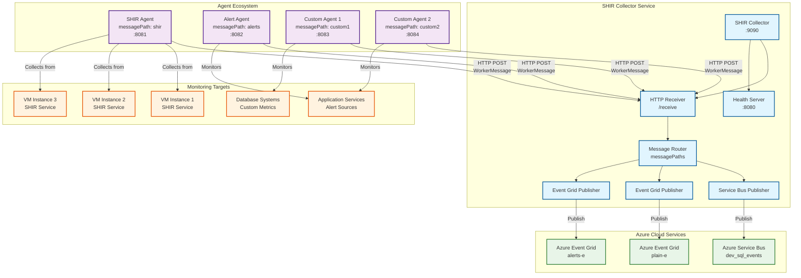
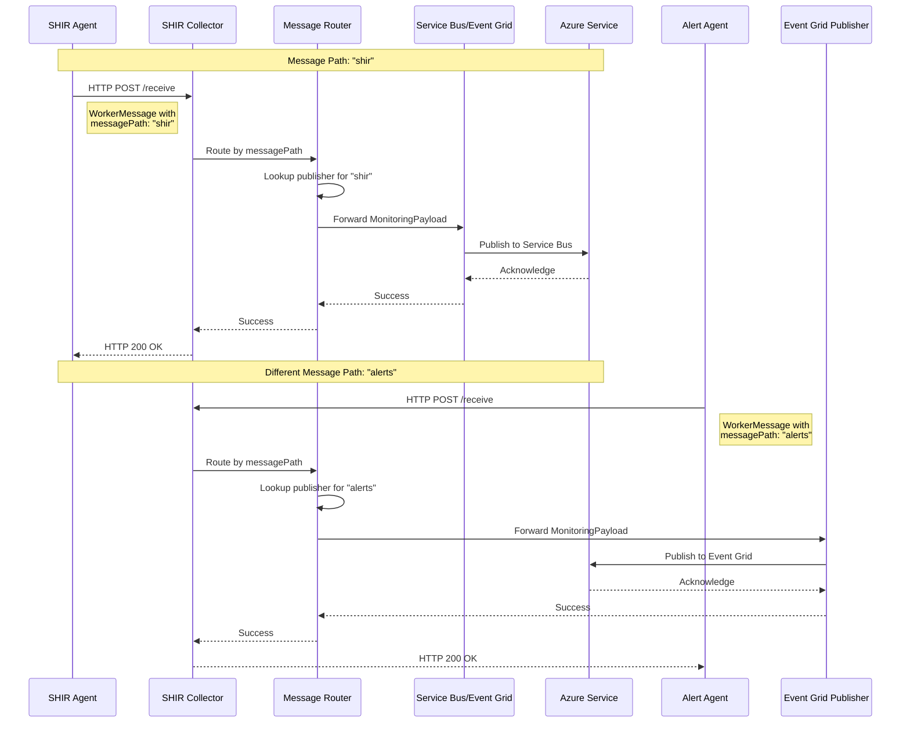

# Monitoring System Architecture

## Overview

The Monitoring System is a distributed monitoring solution designed to collect metrics from multiple agent types and route them to different Azure services based on message paths. The system consists of a central collector service and various specialized agents that can be deployed across different environments.

## Architecture Components

### 1. SHIR Collector (Distributed Service)
The central hub that receives, processes, and forwards monitoring data from all connected agents.

**Key Features:**
- Multi-path message routing
- Support for multiple publishers (Service Bus, Event Grid)
- HTTP-based receiver service
- Health monitoring and status tracking
- Configurable message paths and destinations

### 2. SHIR Agents (Worker Services)
Specialized monitoring agents that collect specific types of metrics and send them to the collector.

**Current Agent Types:**
- **SHIR Agent**: Monitors VM metrics and SHIR service status
- **Alert Agent**: (Planned) Handles alert notifications and events
- **Custom Agents**: Can be developed for specific monitoring needs

## System Architecture Diagram



## Message Flow Architecture



## Configuration Architecture

### Collector Configuration Structure
```yaml
messagePaths:
  shir:
    publisher: "servicebus"
    serviceBus:
      connectionString: "..."
      queueName: "dev_sql_events"
  
  alerts:
    publisher: "eventgrid"
    eventGrid:
      endpoint: "https://..."
      topic: "alerts-e"
      accessKey: "..."
  
  custom1:
    publisher: "servicebus"
    serviceBus:
      connectionString: "..."
      queueName: "custom-metrics"
```

### Agent Configuration Structure
```yaml
Worker:
  id: "agent-unique-id"
  DistributorUrl: "http://collector:9090"
  sendTimeout: 30
  messagePath: "shir"  # Determines routing destination
```

## Multi-Agent Support

The collector is designed to handle **multiple agent types simultaneously**:

### Supported Agent Types:
1. **SHIR Agents** - VM and SHIR service monitoring
2. **Alert Agents** - Event and alert notifications  
3. **Custom Agents** - Application-specific metrics
4. **Future Agent Types** - Extensible architecture

### Agent Registration Process:
1. Agent starts with configured `messagePath`
2. Agent sends first message to collector `/receive` endpoint
3. Collector routes based on `messagePath` field
4. Collector tracks agent connection in `Workerren` map
5. Health monitoring tracks agent status

## Data Models

### WorkerMessage (Agent → Collector)
```json
{
  "machineName": "server-01",
  "timestamp": "2024-01-01T12:00:00Z",
  "vm": {
    "cpuPercent": 45.2,
    "memoryPercent": 67.8,
    "diskPercent": 23.1,
    "uptimeSeconds": 86400
  },
  "shir": {
    "serviceStatus": "Running",
    "nodeStatus": "Ready",
    "version": "5.0.0.0"
  },
  "environment": "production",
  "WorkerId": "server-01-1704110400",
  "messagePath": "shir"
}
```

### MonitoringPayload (Collector → Azure)
```json
{
  "machineName": "server-01",
  "timestamp": "2024-01-01T12:00:00Z",
  "vm": {
    "cpuPercent": 45.2,
    "memoryPercent": 67.8,
    "diskPercent": 23.1,
    "uptimeSeconds": 86400
  },
  "shir": {
    "serviceStatus": "Running",
    "nodeStatus": "Ready",
    "version": "5.0.0.0"
  },
  "environment": "production"
}
```

## Scalability Considerations

### Current Limitations:
- Synchronous message processing
- No message queuing
- Single HTTP server instance

### Scaling Strategies:
1. **Horizontal Scaling**: Deploy multiple collector instances
2. **Async Processing**: Add message queues for buffering
3. **Connection Pooling**: Optimize HTTP connections
4. **Load Balancing**: Distribute agents across collectors

### Estimated Capacity:
- **Conservative**: 100-500 concurrent agents
- **Optimistic**: 1,000-2,000 concurrent agents
- **With Scaling**: 10,000+ concurrent agents

## Security Considerations

### Current Security:
- HTTP communication (consider HTTPS for production)
- Azure service authentication via connection strings/keys
- No built-in agent authentication

### Recommended Enhancements:
- TLS/HTTPS for all communications
- Agent authentication tokens
- Network security groups/firewall rules
- Azure Key Vault for secrets management

## Deployment Architecture

### Development Environment:
```
localhost:9090  ← SHIR Collector
localhost:8080  ← Collector Health API
localhost:8081  ← SHIR Agent
localhost:8082  ← Alert Agent
```

### Production Environment:
```
collector.internal.company.com:9090  ← SHIR Collector (HA)
agent-01.internal.company.com:8081    ← SHIR Agent
agent-02.internal.company.com:8081    ← SHIR Agent
alerts.internal.company.com:8082      ← Alert Agent
```

## Extensibility

The architecture supports easy addition of new agent types:

1. **Define new messagePath** in collector config
2. **Configure publisher** (Service Bus, Event Grid, or custom)
3. **Create new agent** with appropriate messagePath
4. **Deploy agent** - no collector changes needed

This design allows the system to grow with organizational monitoring needs while maintaining a centralized collection and routing mechanism.
